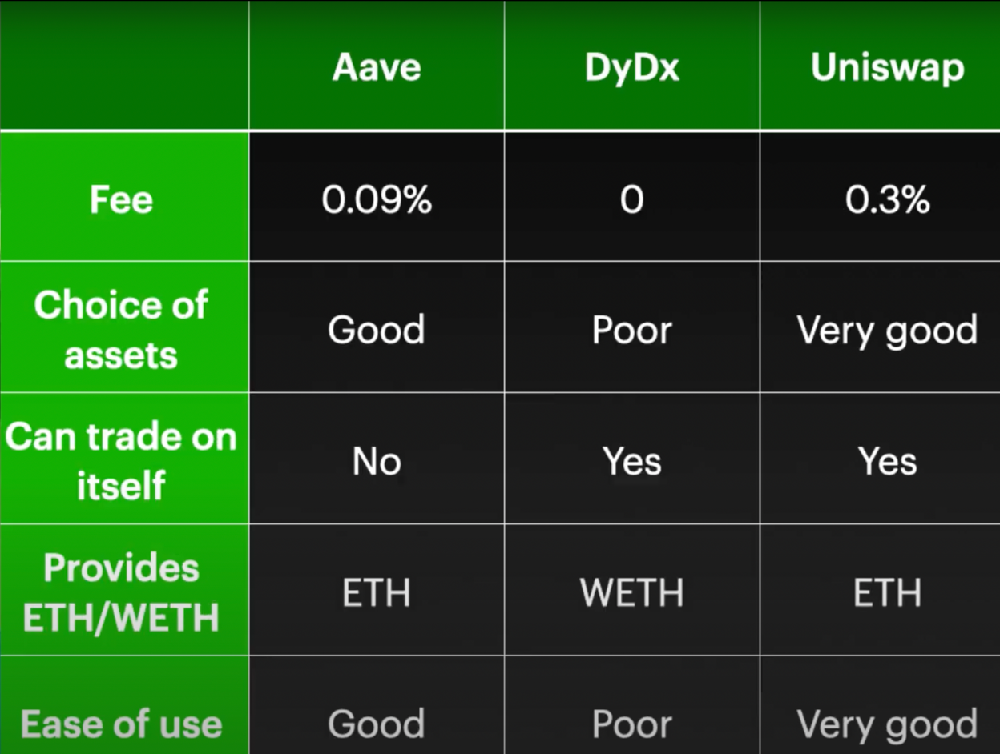

# Arbitrage on Ethereum, leveraging dYdX Flash Loans and KyberSwap's Aggregator API

## Arbitrage strategy

- use KyberSwap Router to find the best route to take when swapping assets
  - find best route and swap token A for token B
  - find best route and swap token B for token A
  - if the token A final balance is greater than the token A initial balance, then the arbitrage is profitable
- for a big leverage, make use of flash loans, to move large amounts of assets from one exchange to another
- all operations on the blockchain are performed inside a single transaction
- in the event that arbitrage is not profitable, the only losses incurred are gas fees.

### Trading pair: WETH <-> USDC 

### Liquidity aggregator: KyberSwap

### Flash loan provider: DyDx

## Development

### Batch | Monitor blockchain for arbitrage opportunities

- Node.js program that listens to new blocks by using a websocket connection 
  - use `web3.eth.subscribe`
- initialize a web3.js instance over websocket connection
- hide the sensible data in a .env file
- when a new block is mined, the job uses KyberSwap Aggregator API to evaluate the arbitrage opportunity
  - use KyberSwap Aggregator API to get the best route to swap X WETH for Y USDC
  - use KyberSwap Aggregator API to get the best route to swap Y USDC for Z WETH
  - if Z - X - gasFees > 0, then the arbitrage is profitable
- if the arbitrage is profitable, the job sends a transaction to the Arbitrage Smart Contract

- The program can also be used to withdraw profits accumulated by the Arbitrage Smart Contract

### Solidity Smart Contract | Take action on arbitrage opportunities

- use DyDx to create a flash loan for X WETH
- call AggregationRouter with encoded swap data to swap X WETH for Y USDC
- call AggregationRouter with encoded swap data to swap Y USDC for Z WETH
- if Z > X, then the arbitrage is profitable and the transaction should succeed, else the transaction will revert
